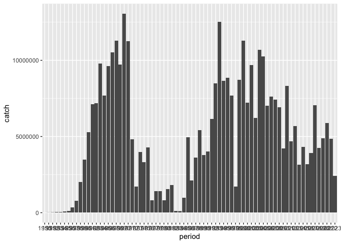

## Instructions
Answer the following questions and/or complete the exercises in RMarkdown. Please embed all of your code and push the final work to your repository. Your report should be organized, clean, and run free from errors. Remember, you must remove the `#` for any included code chunks to run.  

## Load the libraries

``` r
library("tidyverse")
library("janitor")
# library("naniar")
options(scipen = 999)
```

## About the Data
For this assignment we are going to work with a data set from the [United Nations Food and Agriculture Organization](https://www.fao.org/fishery/en/collection/capture) on world fisheries. These data were downloaded and cleaned using the `fisheries_clean.Rmd` script.  

Load the data `fisheries_clean.csv` as a new object titled `fisheries_clean`.

``` r
fisheries_clean <- read_csv("data/fisheries_clean.csv")
```

1. Explore the data. What are the names of the variables, what are the dimensions, are there any NA's, what are the classes of the variables, etc.? You may use the functions that you prefer.

``` r
glimpse(fisheries_clean)
```

```
## Rows: 1,055,015
## Columns: 9
## $ period          <dbl> 1950, 1951, 1952, 1953, 1954, 1955, 1956, 1957, 1958, …
## $ continent       <chr> "Asia", "Asia", "Asia", "Asia", "Asia", "Asia", "Asia"…
## $ geo_region      <chr> "Southern Asia", "Southern Asia", "Southern Asia", "So…
## $ country         <chr> "Afghanistan", "Afghanistan", "Afghanistan", "Afghanis…
## $ scientific_name <chr> "Osteichthyes", "Osteichthyes", "Osteichthyes", "Ostei…
## $ common_name     <chr> "Freshwater fishes NEI", "Freshwater fishes NEI", "Fre…
## $ taxonomic_code  <chr> "1990XXXXXXXX106", "1990XXXXXXXX106", "1990XXXXXXXX106…
## $ catch           <dbl> 100, 100, 100, 100, 100, 200, 200, 200, 200, 200, 200,…
## $ status          <chr> "A", "A", "A", "A", "A", "A", "A", "A", "A", "A", "A",…
```
\
'fisheries.clean' is a dataframe with 9 columns and over 1,000,000 rows.  Its variables are 'period',  'continent', 'geo_region',' country', 'scientific_name', 'common_name', 'taxonomic_code', 'catch', and 'status'.  'period' and 'catch' are classed as decibels while the rest of the variables are in the character class.
\
\
2. Convert the following variables to factors: `period`, `continent`, `geo_region`, `country`, `scientific_name`, `common_name`, `taxonomic_code`, and `status`.

``` r
fisheries_clean <- fisheries_clean %>% 
  mutate(across(c(period, continent, geo_region, country, scientific_name, common_name, taxonomic_code, status), as.factor))
```

## 3. Are there any missing values in the data? If so, which variables contain missing values and how many are missing for each variable?


4. How many countries are represented in the data?

``` r
fisheries_clean %>% 
  distinct(country)
```

```
## # A tibble: 249 × 1
##    country            
##    <fct>              
##  1 Afghanistan        
##  2 Albania            
##  3 Algeria            
##  4 American Samoa     
##  5 Andorra            
##  6 Angola             
##  7 Anguilla           
##  8 Antigua and Barbuda
##  9 Argentina          
## 10 Armenia            
## # ℹ 239 more rows
```
\
249 countries are represented in the data.
\
\
5. The variables `common_name` and `taxonomic_code` both refer to species. How many unique species are represented in the data based on each of these variables? Are the numbers the same or different?

``` r
fisheries_clean %>% 
  distinct(common_name) 
```

```
## # A tibble: 3,390 × 1
##    common_name            
##    <fct>                  
##  1 Freshwater fishes NEI  
##  2 Crucian carp           
##  3 Common carp            
##  4 Grass carp(=White amur)
##  5 Silver carp            
##  6 Bighead carp           
##  7 Wuchang bream          
##  8 Bleak                  
##  9 Orfe(=Ide)             
## 10 Common dace            
## # ℹ 3,380 more rows
```

``` r
fisheries_clean %>% 
  distinct(taxonomic_code)
```

```
## # A tibble: 3,722 × 1
##    taxonomic_code 
##    <fct>          
##  1 1990XXXXXXXX106
##  2 140014109002   
##  3 140014113401   
##  4 140018102601   
##  5 140018104601   
##  6 140018104602   
##  7 140018105801   
##  8 140023102602   
##  9 140023114204   
## 10 140023114205   
## # ℹ 3,712 more rows
```
\
`common_name` and `taxonomic_code` differ by the number of unique species they represent.  `common_name` represents 3390 unique species while `taxonomic_code` represents 3722 unique species.
\
\
6. In 2023, what were the top five countries that had the highest overall catch?

``` r
fisheries_clean %>% 
  filter(period == 2023) %>% 
  select(country, catch) %>% 
  group_by(country) %>% 
  summarise(total_catch = max(catch)) %>% 
  arrange(desc(total_catch)) %>% 
  filter(total_catch >= 1433538)
```

```
## # A tibble: 5 × 2
##   country                  total_catch
##   <fct>                          <dbl>
## 1 China                       2661523.
## 2 Viet Nam                    2190211.
## 3 Peru                        2047732.
## 4 Russian Federation          1893580 
## 5 United States of America    1433538
```
\
In 2023, the top five countries that had the highest overall catch were China, Vietnam, Peru, Russian Federation, and the United States of America.
\
\
7. In 2023, what were the top 10 most caught species? To keep things simple, assume `common_name` is sufficient to identify species. What does `NEI` stand for in some of the common names? How might this be concerning from a fisheries management perspective?

``` r
fisheries_clean %>% 
  filter(period == 2023) %>% 
  select(common_name, catch) %>% 
  group_by(common_name) %>% 
  summarise(total_caught = max(catch)) %>% 
  arrange(desc(total_caught)) %>% 
  filter(total_caught >= 910275.000)
```

```
## # A tibble: 5 × 2
##   common_name                    total_caught
##   <fct>                                 <dbl>
## 1 Marine fishes NEI                  2661523.
## 2 Anchoveta(=Peruvian anchovy)       2047732.
## 3 Alaska pollock(=Walleye poll.)     1893580 
## 4 Freshwater fishes NEI              1040470 
## 5 Largehead hairtail                  910275
```
\
In 2023, the top 10 most caught species were Marine fishes, Peruvian anchovy, Alaska pollock, freshwater fishes, and Largehead hairtail.  However, some of the species have 'NEI' in their common name, meaning that their catch data is record but cannot be specifically identified by species.  From a fisheries management perspective, these are major global data gaps that potentially hide the actualextent of overfishing, making effective, targeted management of marine resources difficult to achieve.
\
\
8. For the species that was caught the most above (not NEI), which country had the highest catch in 2023?

``` r
fisheries_clean %>% 
  filter(period == "2023", common_name == "Anchoveta(=Peruvian anchovy)") %>%
  group_by(country) %>% 
  summarise(highest_catch = max(catch)) %>% 
  arrange(desc(highest_catch))
```

```
## # A tibble: 3 × 2
##   country highest_catch
##   <fct>           <dbl>
## 1 Peru         2047732.
## 2 Chile         353267 
## 3 Ecuador        14710.
```
\
In 2023, Peru had the highest catch of Anchoveta (Peruvian anchovy).
\
\
9. How has fishing of this species changed over the last decade (2013-2023)? Create a  plot showing total catch by year for this species.

``` r
fisheries_clean %>% 
  select(period, common_name, catch) %>% 
  filter(common_name == "Anchoveta(=Peruvian anchovy)") %>% 
  ggplot(aes(x = period, y = catch)) +
  geom_col() +
  scale_x_discrete(limits = c("2013", "2014", "2015", "2017", "2018", "2019", "2020", "2021", "2022", "2023")) +
  labs(
    title = "Total Catch by Year (2013-2023)",
    x = "Year",
    y = "Total Ctach"
  )
```

```
## Warning: Removed 172 rows containing missing values or values outside the scale range
## (`geom_col()`).
```

<!-- -->
\
Over the last decade, the total catch of Anchoveta peaked at over 7000000 fish in 2018 and reached it lowest at below 3000000 fish in 2023.
\
\
10. Perform one exploratory analysis of your choice. Make sure to clearly state the question you are asking before writing any code.

``` r
fisheries_clean %>% 
  select(period, country, common_name, catch) %>%
  filter(country == "China") %>% 
  filter(period == c("2013", "2014", "2015", "2017", "2018", "2019", "2020", "2021", "2022", "2023")) %>% 
  group_by(common_name) %>% 
  summarise(average_caught = mean(catch)) %>% 
  filter(average_caught != 0) %>% 
  arrange(desc(average_caught))
```

```
## # A tibble: 25 × 2
##    common_name             average_caught
##    <fct>                            <dbl>
##  1 Marine molluscs NEI            388947.
##  2 Daggertooth pike conger        379929.
##  3 Aquatic plants NEI             198699.
##  4 Sardinellas NEI                182613.
##  5 Porgies, seabreams NEI         133162.
##  6 Marine crabs NEI                94044.
##  7 Charybdis crabs NEI             58562.
##  8 Albacore                         3018.
##  9 Bigeye tuna                       778.
## 10 Marine fishes NEI                 674.
## # ℹ 15 more rows
```
\
Question: What were the top ten fish species (excluding those reported with "NEI") caught on average in China over the past decade?
\
\
Answer: From highest to lowest average, the top ten fish species caught on average in China are Albacore, Bigeye tuna, Blue shark, Swordfish, Yellowfin tuna, Shortfin mako, Black marlin, Striped marlin, Oceanic whitetip shark, and Blue marlin.  It is worth noting that the majority of species record included the "NEI" tag.  This is concerning as it could be used to hide the effects of overfishing.
\
\
## Knit and Upload
Please knit your work as an .html file and upload to Canvas. Homework is due before the start of the next lab. No late work is accepted. Make sure to use the formatting conventions of RMarkdown to make your report neat and clean!  
